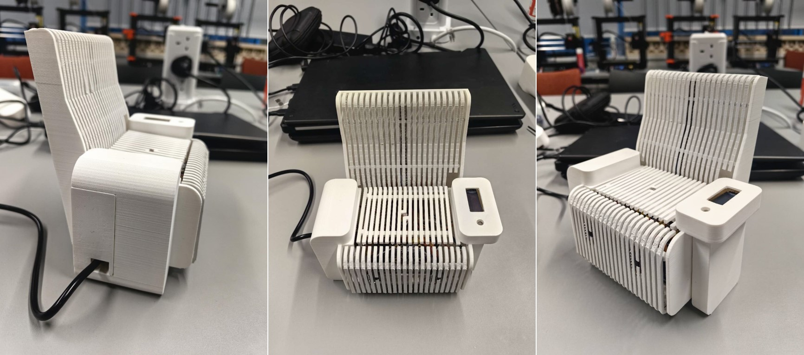
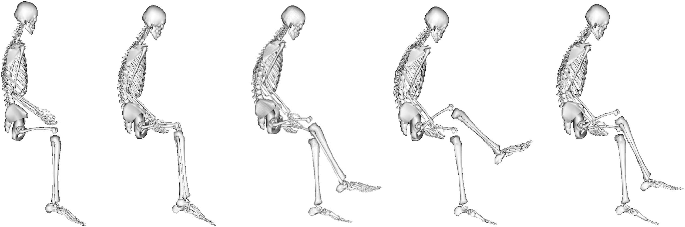
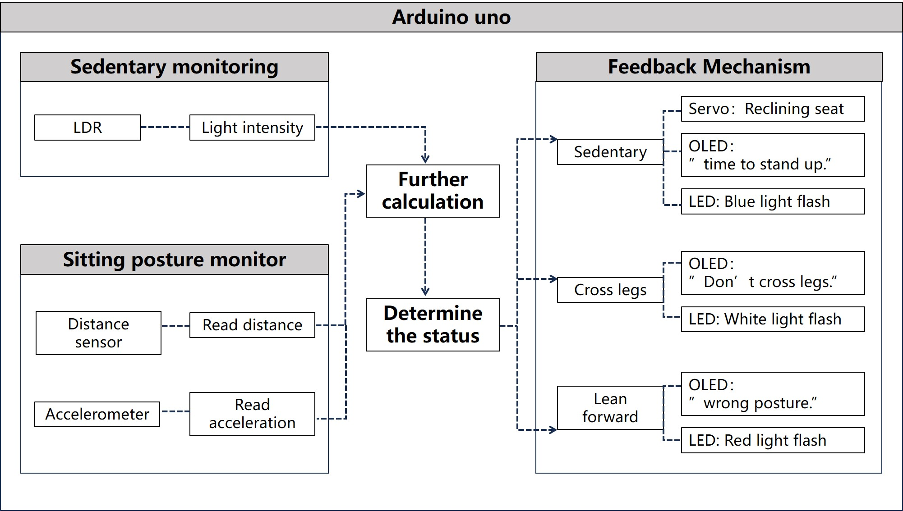
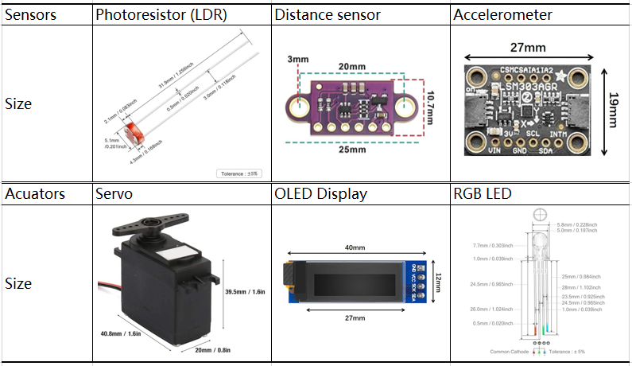
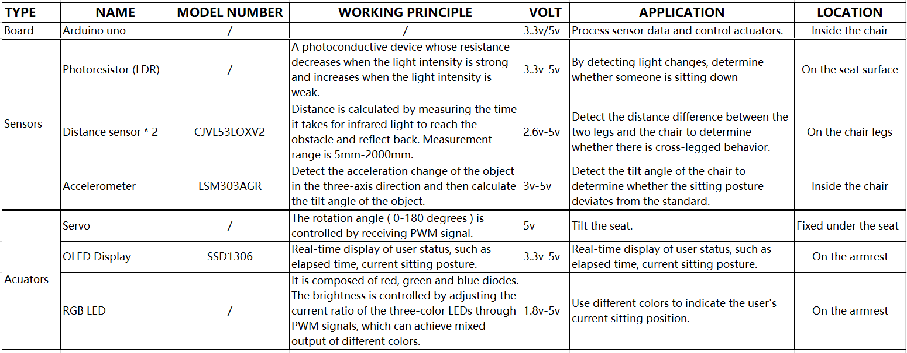

# casa0016 coursework_smart chair

1. IoT applications and health 
    In recent years, IoT applications have expanded rapidly and have been widely present in various industries and domains (A. Khanna and S. Kaur, 2020). These connected devices act as network nodes, equipped with low-memory and low-power components that collect data from the surrounding environment via sensors and transmit it to a system or smart device for computation (J. Beal et al, 2015). Among IoT applications, smart home and health monitoring can significantly improve people's livelihood (K. Maswadi, 2022). 
    Meanwhile, modern lifestyles increasingly involve being sedentary, especially in work and study environments. Although multiple studies highlight that long-term poor posture can lead to serious cervical and lumbar vertebrae diseases (Channel, 2015), as well as constipation and other non-spinal diseases (Pynt, J. et al, 2001). People often lose sight of time and sitting posture during focused activities, and are unable to make timely adjustments to avoid injury. 
    
    *Different sitting positions: The leftmost one is correct. *

2. project aims
    After recognizing the health risks associated with sedentary behavior and poor posture, the project is designed to develop a smart chair equipped with a real-time posture recognition system that alerts users to correct their sitting posture and prevents prolonged sitting, thereby reducing long-term health risks. Limited by resource and development time, the project focuses on developing a 1:8 scale chair prototype (the scale is determined by the actual dimensions of the components) to verify its feasibility and core functionality. 

## Design workflow

#Hardware
## Components

## Wiring
Read the data-sheet of each component to know their specific wiring requirements. Then, after calculation and analysis, connect the circuit.
1. Voltage demand: All sensors can operate at 5V, so they can be powered directly through the 5V interface of the Arduino UNO board. Among them, since the resistance value of the photoresistor cannot be measured, it needs to be connected with a 10 kΩ fixed resistor in series to form a voltage division circuit, which converts the resistance change into a voltage signal and transmits it to the board. 
2. LED Resistance calculation: Each channel of RGB LED needs a current-limiting resistor in series to prevent excessive current from damaging the component. The known power supply voltage V_in is 5V, the working current 〖 I〗_f of RGB LED is 20mA, and the working voltage 〖 V〗_f of each channel is red LED:  1.8-2.2V, green LED: 2.8-3.2V, blue LED: 2.8-3.2V. 
According to Ohm's law: 
R=(V_in-V_f)/I_f 
Each channel can be calculated as follows: 
R_r=(5-2)/0.02=150 Ω

R_g=(5-3)/0.02=100 Ω

R_b=(5-3)/0.02=100 Ω

	PCB Circuit: The breadboard is easy for prototype development, but the connection points are unstable. To improve reliability and reduce cable clutter (Fig. 4), this project uses a strip PCB covered with parallel copper foil lines that can be used as separate wires or isolated by scraping off the copper foil. Different strips can be welded to form a path to complete the circuit design. All components are connected by welded male/female pins for flexible disassembly.

## reflection

## reference
