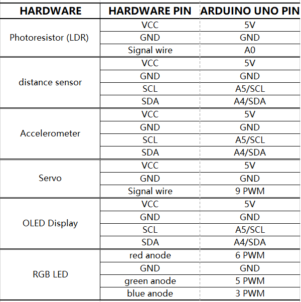
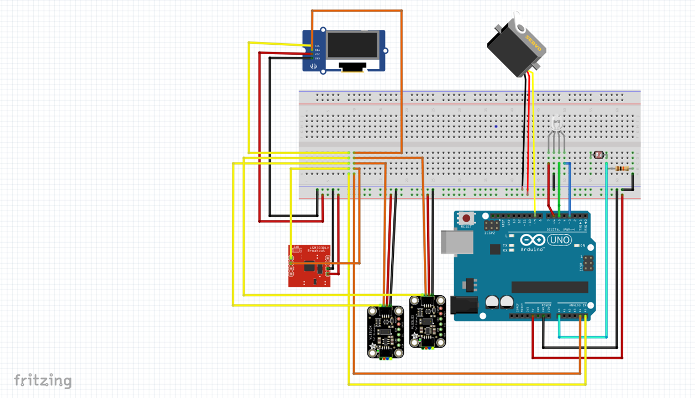
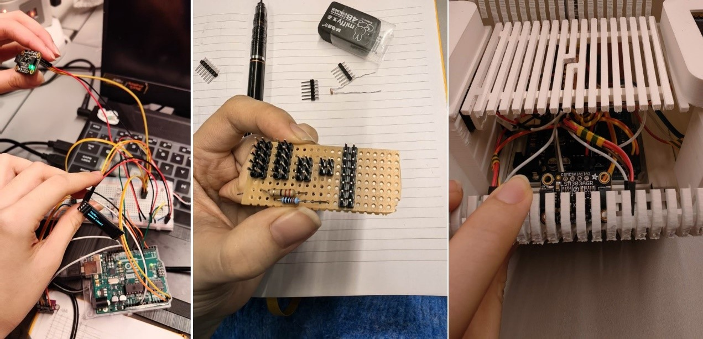
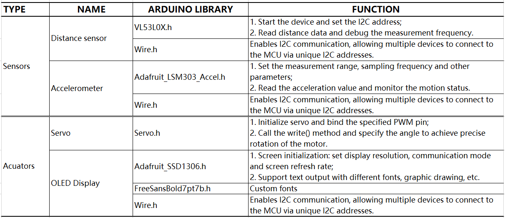
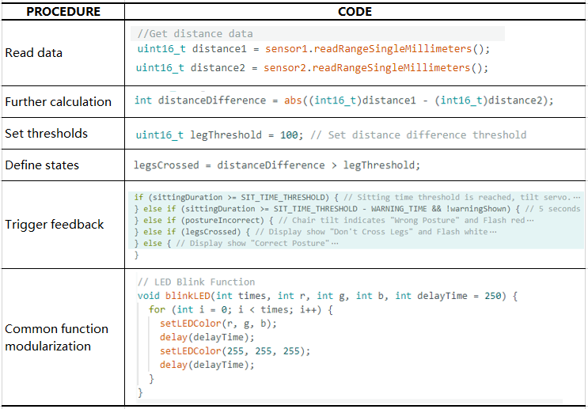
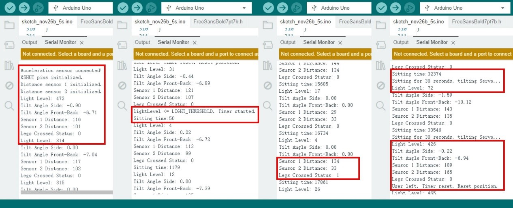
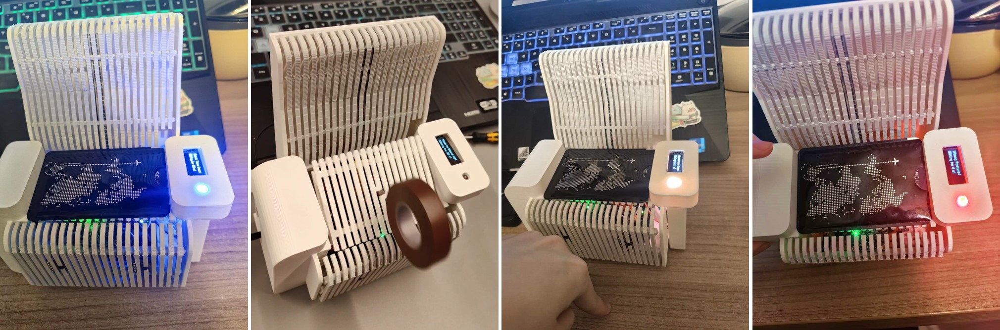

# casa0016 coursework_smart chair

1. IoT applications and health 
    In recent years, IoT applications have expanded rapidly and have been widely present in various industries and domains (A. Khanna and S. Kaur, 2020). These connected devices act as network nodes, equipped with low-memory and low-power components that collect data from the surrounding environment via sensors and transmit it to a system or smart device for computation (J. Beal et al, 2015). Among IoT applications, smart home and health monitoring can significantly improve people's livelihood (K. Maswadi, 2022). 
    Meanwhile, modern lifestyles increasingly involve being sedentary, especially in work and study environments. Although multiple studies highlight that long-term poor posture can lead to serious cervical and lumbar vertebrae diseases (Channel, 2015), as well as constipation and other non-spinal diseases (Pynt, J. et al, 2001). People often lose sight of time and sitting posture during focused activities, and are unable to make timely adjustments to avoid injury. 
    
    *Different sitting positions: The leftmost one is correct. *

2. project aims
    After recognizing the health risks associated with sedentary behavior and poor posture, the project is designed to develop a smart chair equipped with a real-time posture recognition system that alerts users to correct their sitting posture and prevents prolonged sitting, thereby reducing long-term health risks. Limited by resource and development time, the project focuses on developing a 1:8 scale chair prototype (the scale is determined by the actual dimensions of the components) to verify its feasibility and core functionality. 

## Design workflow

# Hardware
## Components

## Wiring
Read the data-sheet of each component to know their specific wiring requirements. Then, after calculation and analysis, connect the circuit.
1. Voltage demand: All sensors can operate at 5V, so they can be powered directly through the 5V interface of the Arduino UNO board. Among them, since the resistance value of the photoresistor cannot be measured, it needs to be connected with a 10 kΩ fixed resistor in series to form a voltage division circuit, which converts the resistance change into a voltage signal and transmits it to the board. 
2. LED Resistance calculation: Each channel of RGB LED needs a current-limiting resistor in series to prevent excessive current from damaging the component. 
3.PCB Circuit: The breadboard is easy for prototype development, but the connection points are unstable. To improve reliability and reduce cable clutter, this project uses a strip PCB covered with parallel copper foil lines that can be used as separate wires or isolated by scraping off the copper foil. Different strips can be welded to form a path to complete the circuit design. All components are connected by welded male/female pins for flexible disassembly.

# Software
## Code testing
The project is developed based on Arduino IDE, and integrated after ensuring the normal function of hardware and library through step by step testing. The basic process of the test is to compare the sensor data collected in real time and the threshold set by the experiment to judge the user's sitting posture. Then each state is defined as a Boolean value, and each actuator is fed back with a conditional statement. Taking the judgment and feedback of the cross-legged sitting posture as an example. 

    *The required libraries *

    *Coding test example *
## Data visualization

    *The data from left to right: all sensor readings; user sitting timer (in seconds); sitting posture determination; seat tilt status.*

    *Chair status from left to right: blue light reminds the user to stand up 5 minutes in advance; the seat tilts after sitting for 30 minutes; white light indicates a crossed-leg posture; red light indicates leaning forward.*

# Achievement
https://github.com/user-attachments/assets/724f43f9-d20b-43c4-ae0d-05f0e35d009c

# Future development
1. Detection system optimization:  
Current sitting posture monitoring systems are not comprehensive enough, especially for users with low weight or slight posture changes, who may not drive the chair to significantly recline. Future iterations could introduce more advanced monitoring systems; for example, According to Isaac Morales-Nolasco et al (2023), pressure mapping system with Convolutional Neural Networks (CNN) could achieve 85.4% accuracy when detecting three different postures. 
2. Feedback system optimization: While servo works well for scaled-down prototype testing, their performance isn't good enough for real-size chair design. Linear actuators can be used instead to enhance the bearing capacity of the tilting mechanism. Further adjustment of the tilt angle and braking strength should be conducted to ensure that the physical intervention remains effective while ensuring user comfort. 
3. Enhance interaction: Wireless communication and mobile application support can be involved in the future. Store and analyze user data with mobile apps allows users to track their sitting posture habits and adapt to different user needs. 

# References
1. Khanna, A., Kaur, S. (2020) Internet of Things (IoT), Applications and Challenges: A Comprehensive Review. Wireless Pers Commun, 114, 1687–1762. 
2. J. Beal, D. Pianini, M. Viroli (2015) Aggregate programming for the internet of things. Computer, 48 (9), 22–30.
3. Maswadi K, Ghani NA, Hamid S. (2022) Factors influencing the elderly’s behavioural intention to use smart home technologies in Saudi Arabia. PLoS ONE, 17(8): e0272525.
4. the Department of Health, State Government of Victoria, Australia. (2015) Posture. Channal, Better Health. 
Available at: https://www.betterhealth.vic.gov.au/health/conditionsandtreatments/posture. (Accessed: 04 January 2025).
5. Pynt, J., Higgs, J., Mackey, M. (2001) Seeking the optimal posture of the seated lumbar spine. Physiotherapy Theory and Practice, 17(1), 5–21.
6. Duran AT, Friel CP, Serafini MA, Ensari I, Cheung YK, Diaz KM. (2023) Breaking Up Prolonged Sitting to Improve Cardiometabolic Risk: Dose-Response Analysis of a Randomized Crossover Trial. Med Sci Sports Exerc, 55(5), 847-855. 
7. Yilin Wang, Xiaoshan Lei, Yunchao Ma (2025) The Effect of swivel chairs on lumbar health in individuals with TFCLs sitting Habits: An analysis of lumbar disc Mechanical characteristics during Postural changes. Journal of Biomechanics, 178: 112435.
8. Kaiyuan Ma, Shunan Song, Lingling An, Shiwen Mao, Xuyu Wang (2024) APC: Contactless healthy sitting posture monitoring with microphone array. Smart Health, 32: 100463.
9. Isaac Morales-Nolasco, Sandra Arias-Guzman, Laura Garay-Jiménez (2024) A method for complex posture recognition during long-term sitting using neural networks and pressure mapping systems. Biomedical Signal Processing and Control, 95 (Part A): 106306. 

